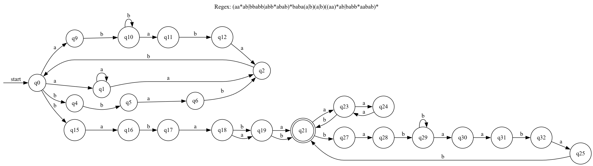
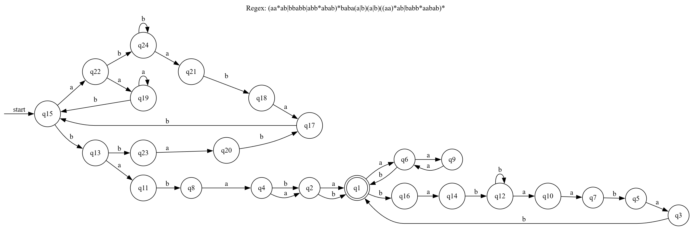
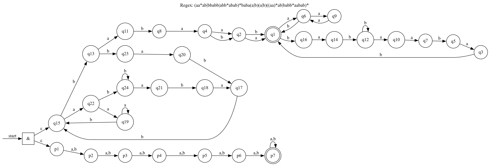

# Лабораторная работа №2 по курсу «Теория формальных языков»

Студент: Ладонцева Анна Андреевна ИУ9-52Б

Дано академическое регулярное выражение (вариант 14): `(aa*ab|bbabb|abb*abab)*baba(a|b)(a|b)((aa)*ab|babb*aabab)*`

### 1. Возможно малый НКА

Таблица классов эквиволентности 

| №   | ε   | a   | aa  | ааа | aaab | baaa | aaaab | aabab | abaaa | baaab | babab | abaaab | ababab | baabab | babaaa | abaabab | bbabaaa | bbbabaaa | aabbabaaa | abbbabaaa | babbabaaa | ababbabaaa | abbabaaaab | babbbabaaa | bababbabaaa |
|-----|-----|-----|-----|-----|------|------|-------|-------|-------|-------|-------|--------|--------|--------|--------|---------|---------|----------|-----------|-----------|-----------|------------|------------|------------|-------------|
| 21  | 1   | 0   | 0   | 0   | 1    | 0    | 0     | 0     | 0     | 0     | 0     | 1      | 1      | 0      | 0      | 0       | 0       | 0        | 0         | 0         | 0         | 0          | 0          | 0          | 0           |
| 19  | 0   | 1   | 0   | 0   | 0    | 0    | 1     | 1     | 0     | 1     | 1     | 0      | 0      | 0      | 0      | 0       | 0       | 0        | 0         | 0         | 0         | 0          | 0          | 0          | 0           |
| 18  | 0   | 0   | 0   | 0   | 1    | 0    | 0     | 0     | 0     | 0     | 0     | 1      | 1      | 1      | 0      | 0       | 0       | 0        | 0         | 0         | 0         | 0          | 0          | 0          | 0           |
| 17  | 0   | 0   | 0   | 1   | 0    | 0    | 1     | 0     | 0     | 0     | 0     | 0      | 0      | 0      | 0      | 1       | 0       | 0        | 0         | 0         | 0         | 0          | 0          | 0          | 0           |
| 24  | 0   | 0   | 0   | 0   | 1    | 0    | 0     | 0     | 0     | 0     | 0     | 1      | 1      | 0      | 0      | 0       | 0       | 0        | 0         | 0         | 0         | 0          | 0          | 0          | 0           |
| 16  | 0   | 0   | 0   | 0   | 0    | 1    | 0     | 0     | 0     | 0     | 0     | 0      | 0      | 1      | 0      | 0       | 0       | 0        | 0         | 0         | 0         | 0          | 0          | 0          | 0           |
| 23  | 0   | 0   | 0   | 0   | 0    | 0    | 1     | 1     | 0     | 1     | 1     | 0      | 0      | 0      | 0      | 0       | 0       | 0        | 0         | 0         | 0         | 0          | 0          | 0          | 0           |
| 29  | 0   | 0   | 0   | 0   | 0    | 0    | 0     | 1     | 0     | 0     | 0     | 0      | 0      | 1      | 0      | 0       | 0       | 0        | 0         | 0         | 0         | 0          | 0          | 0          | 0           |
| 15  | 0   | 0   | 0   | 0   | 0    | 0    | 0     | 0     | 1     | 0     | 0     | 0      | 0      | 0      | 0      | 1       | 0       | 0        | 0         | 0         | 0         | 0          | 0          | 0          | 0           |
| 25  | 0   | 0   | 0   | 0   | 0    | 0    | 0     | 0     | 0     | 1     | 1     | 0      | 0      | 0      | 0      | 0       | 0       | 0        | 0         | 0         | 0         | 0          | 0          | 0          | 0           |
| 31  | 0   | 0   | 0   | 0   | 0    | 0    | 0     | 0     | 0     | 0     | 1     | 0      | 0      | 0      | 0      | 0       | 0       | 0        | 0         | 0         | 0         | 0          | 0          | 0          | 0           |
| 32  | 0   | 0   | 0   | 0   | 0    | 0    | 0     | 0     | 0     | 0     | 0     | 1      | 1      | 0      | 0      | 0       | 0       | 0        | 0         | 0         | 0         | 0          | 0          | 0          | 0           |
| 30  | 0   | 0   | 0   | 0   | 0    | 0    | 0     | 0     | 0     | 0     | 0     | 0      | 1      | 0      | 0      | 0       | 0       | 0        | 0         | 0         | 0         | 0          | 0          | 0          | 0           |
| 28  | 0   | 0   | 0   | 0   | 0    | 0    | 0     | 0     | 0     | 0     | 0     | 0      | 0      | 1      | 0      | 0       | 0       | 0        | 0         | 0         | 0         | 0          | 0          | 0          | 0           |
| 0   | 0   | 0   | 0   | 0   | 0    | 0    | 0     | 0     | 0     | 0     | 0     | 0      | 0      | 0      | 1      | 0       | 0       | 0        | 1         | 0         | 0         | 0          | 0          | 0          | 0           |
| 27  | 0   | 0   | 0   | 0   | 0    | 0    | 0     | 0     | 0     | 0     | 0     | 0      | 0      | 0      | 0      | 1       | 0       | 0        | 0         | 0         | 0         | 0          | 0          | 0          | 0           |
| 2   | 0   | 0   | 0   | 0   | 0    | 0    | 0     | 0     | 0     | 0     | 0     | 0      | 0      | 0      | 0      | 0       | 1       | 0        | 0         | 0         | 0         | 0          | 0          | 0          | 0           |
| 6   | 0   | 0   | 0   | 0   | 0    | 0    | 0     | 0     | 0     | 0     | 0     | 0      | 0      | 0      | 0      | 0       | 0       | 1        | 0         | 0         | 0         | 0          | 0          | 0          | 0           |
| 1   | 0   | 0   | 0   | 0   | 0    | 0    | 0     | 0     | 0     | 0     | 0     | 0      | 0      | 0      | 0      | 0       | 0       | 0        | 1         | 0         | 0         | 1          | 0          | 0          | 0           |
| 5   | 0   | 0   | 0   | 0   | 0    | 0    | 0     | 0     | 0     | 0     | 0     | 0      | 0      | 0      | 0      | 0       | 0       | 0        | 0         | 1         | 0         | 0          | 0          | 0          | 0           |
| 11  | 0   | 0   | 0   | 0   | 0    | 0    | 0     | 0     | 0     | 0     | 0     | 0      | 0      | 0      | 0      | 0       | 0       | 0        | 0         | 0         | 1         | 0          | 0          | 0          | 0           |
| 10  | 0   | 0   | 0   | 0   | 0    | 0    | 0     | 0     | 0     | 0     | 0     | 0      | 0      | 0      | 0      | 0       | 0       | 0        | 0         | 0         | 0         | 1          | 0          | 0          | 1           |
| 12  | 0   | 0   | 0   | 0   | 0    | 0    | 0     | 0     | 0     | 0     | 0     | 0      | 0      | 0      | 0      | 0       | 0       | 0        | 0         | 0         | 0         | 0          | 1          | 0          | 0           |
| 4   | 0   | 0   | 0   | 0   | 0    | 0    | 0     | 0     | 0     | 0     | 0     | 0      | 0      | 0      | 0      | 0       | 0       | 0        | 0         | 0         | 0         | 0          | 0          | 1          | 0           |
| 9   | 0   | 0   | 0   | 0   | 0    | 0    | 0     | 0     | 0     | 0     | 0     | 0      | 0      | 0      | 0      | 0       | 0       | 0        | 0         | 0         | 0         | 0          | 0          | 0          | 1           |

### 2. Минимальный ДКА

Таблица классов эквиволентности 

| №   | Состояние     | ε | a | b | aa | bb | ab | abab | baba | aaa | (ba)^3 | aba  | bab  | aabab | baabab | abaabab | abaaa | abb(ba)^3 | bb(ba)^3 | b(ba)^3 | ab(ba)^3 | bab(ba)^3 | (ab)^2(ba)^3 | a+b(ba)^3 | (ba)^2b(ba)^3 |
|-----|---------------|---|---|---|----|----|----|------|------|-----|--------|------|------|-------|--------|---------|-------|-----------|----------|---------|----------|-----------|--------------|-----------|---------------|
| 15  | ε             | 0 | 0 | 0 | 0  | 0  | 0  | 0    | 0    | 0   | 1      | 0    | 0    | 0     | 0      | 0       | 0     | 0         | 0        | 0       | 0        | 0         | 0            | 0         | 0             |
| 13  | b             | 0 | 0 | 0 | 0  | 0  | 0  | 0    | 0    | 0   | 0      | 0    | 0    | 0     | 0      | 0       | 1     | 0         | 0        | 0       | 0        | 0         | 0            | 0         | 0             |
| 23  | bb            | 0 | 0 | 0 | 0  | 0  | 0  | 0    | 0    | 0   | 0      | 0    | 0    | 0     | 0      | 0       | 0     | 1         | 0        | 0       | 0        | 0         | 0            | 0         | 0             |
| 20  | bba           | 0 | 0 | 0 | 0  | 0  | 0  | 0    | 0    | 0   | 0      | 0    | 0    | 0     | 0      | 0       | 0     | 0         | 1        | 0       | 0        | 0         | 0            | 0         | 0             |
| 17  | bbab          | 0 | 0 | 0 | 0  | 0  | 0  | 0    | 0    | 0   | 0      | 0    | 0    | 0     | 0      | 0       | 0     | 0         | 0        | 1       | 0        | 0         | 0            | 0         | 0             |
| 22  | a             | 0 | 0 | 0 | 0  | 0  | 0  | 0    | 0    | 0   | 0      | 0    | 0    | 0     | 0      | 0       | 0     | 0         | 0        | 0       | 1        | 0         | 0            | 0         | 1             |
| 19  | aa            | 0 | 0 | 0 | 0  | 0  | 0  | 0    | 0    | 0   | 0      | 0    | 0    | 0     | 0      | 0       | 0     | 0         | 0        | 1       | 0        | 0         | 0            | 1         | 0             |
| 24  | ab            | 0 | 0 | 0 | 0  | 0  | 0  | 0    | 0    | 0   | 0      | 0    | 0    | 0     | 0      | 0       | 0     | 0         | 0        | 0       | 0        | 0         | 1            | 0         | 0             |
| 21  | aba           | 0 | 0 | 0 | 0  | 0  | 0  | 0    | 0    | 0   | 0      | 0    | 0    | 0     | 0      | 0       | 0     | 0         | 0        | 0       | 0        | 1         | 0            | 0         | 0             |
| 18  | abab          | 0 | 0 | 0 | 0  | 0  | 0  | 0    | 0    | 0   | 0      | 0    | 0    | 0     | 0      | 0       | 0     | 0         | 0        | 0       | 1        | 0         | 0            | 0         | 0             |
| 11  | ba            | 0 | 0 | 0 | 0  | 0  | 0  | 0    | 1    | 0   | 0      | 0    | 0    | 0     | 0      | 0       | 0     | 0         | 0        | 0       | 0        | 0         | 0            | 0         | 0             |
| 8   | bab           | 0 | 0 | 0 | 0  | 0  | 0  | 0    | 0    | 1   | 0      | 1    | 0    | 0     | 0      | 0       | 0     | 0         | 0        | 0       | 0        | 0         | 0            | 0         | 0             |
| 4   | baba          | 0 | 0 | 0 | 1  | 1  | 1  | 0    | 0    | 0   | 0      | 0    | 0    | 0     | 0      | 0       | 0     | 0         | 0        | 0       | 0        | 0         | 0            | 0         | 0             |
| 2   | babaa         | 0 | 1 | 1 | 0  | 0  | 0  | 0    | 0    | 0   | 0      | 0    | 0    | 0     | 0      | 0       | 0     | 0         | 0        | 0       | 0        | 0         | 0            | 0         | 0             |
| 1   | babaaa        | 1 | 0 | 0 | 0  | 0  | 1  | 0    | 0    | 0   | 0      | 0    | 0    | 0     | 0      | 0       | 0     | 0         | 0        | 0       | 0        | 0         | 0            | 0         | 0             |
| 6   | babaaaa       | 0 | 0 | 1 | 0  | 0  | 0  | 1    | 0    | 0   | 1      | 0    | 0    | 1     | 0      | 0       | 0     | 0         | 0        | 0       | 0        | 0         | 0            | 0         | 0             |
| 9   | babaaaaa      | 0 | 0 | 0 | 0  | 0  | 1  | 0    | 0    | 0   | 0      | 0    | 0    | 0     | 0      | 0       | 0     | 0         | 0        | 0       | 0        | 0         | 0            | 0         | 0             |
| 16  | babaaab       | 0 | 0 | 0 | 0  | 0  | 0  | 0    | 0    | 0   | 0      | 0    | 0    | 0     | 0      | 1       | 0     | 0         | 0        | 0       | 0        | 0         | 0            | 0         | 0             |
| 14  | babaaaba      | 0 | 0 | 0 | 0  | 0  | 0  | 0    | 0    | 0   | 0      | 0    | 0    | 0     | 1      | 0       | 0     | 0         | 0        | 0       | 0        | 0         | 0            | 0         | 0             |
| 12  | babaaabab     | 0 | 0 | 0 | 0  | 0  | 0  | 0    | 0    | 0   | 0      | 0    | 0    | 1     | 0      | 0       | 0     | 0         | 0        | 0       | 0        | 0         | 0            | 0         | 0             |
| 10  | babaaababa    | 0 | 0 | 0 | 0  | 0  | 0  | 1    | 0    | 0   | 0      | 0    | 0    | 0     | 0      | 0       | 0     | 0         | 0        | 0       | 0        | 0         | 0            | 0         | 0             |
| 7   | babaaababaa   | 0 | 0 | 0 | 0  | 0  | 0  | 0    | 0    | 0   | 0      | 0    | 1    | 0     | 0      | 0       | 0     | 0         | 0        | 0       | 0        | 0         | 0            | 0         | 0             |
| 5   | babaaababaab  | 0 | 0 | 0 | 0  | 0  | 1  | 0    | 0    | 0   | 0      | 0    | 0    | 0     | 0      | 0       | 0     | 0         | 0        | 0       | 0        | 0         | 0            | 0         | 0             |
| 3   | babaaababaabb | 0 | 0 | 1 | 0  | 0  | 0  | 0    | 0    | 0   | 0      | 0    | 0    | 0     | 0      | 0       | 0     | 0         | 0        | 0       | 0        | 0         | 0            | 0         | 0             |

### 3. ПКА

Таблица классов эквиволентности 

| Состояние | ε  | b  | aa | ba | aab | baab | aaab | aaaab |
|-----------|----|----|----|----|-----|------|------|-------|
| 26        | 0  | 1  | 1  | 1  | 1   | 1    | 1    | 1     |
| 25        | 0  | 0  | 1  | 1  | 1   | 1    | 1    | 1     |
| 27        | 0  | 1  | 0  | 1  | 1   | 1    | 1    | 1     |
| 2         | 0  | 1  | 0  | 0  | 1   | 1    | 1    | 1     |
| 4         | 0  | 0  | 1  | 1  | 0   | 1    | 1    | 1     |
| 8         | 0  | 0  | 0  | 0  | 1   | 0    | 1    | 1     |
| 6         | 0  | 1  | 0  | 0  | 1   | 1    | 0    | 1     |
| 11        | 0  | 0  | 0  | 0  | 0   | 1    | 0    | 0     |

### 4. Расширенное регулярное выражение.
Из исходного я получила следующее регулярное выражение: ^(a+ab|bbabb|ab+abab)*baba..((aa)*ab|bab+aabab)*$

1. Начало и конец строки: 
Добавлены ^ и $ - это техническое улучшение, которое явно указывает, что выражение должно распозновать всю строку целиком, а не подстроку.

2. a* и a+
a* означает что а может встретиться от 0 до множества раз
а+ означает что а может встретиться от 1 до множества раз

Поэтому в записи aa*ab → a+ab  чтобы не нарушить баланс количества а, я убрала одну основную а (так как она заведомо написана в а+)
аа* эквиволентна а+  (1+(0,∞) = (1,∞))

аналогично с abb*abab → ab+abab  и babb*aabab → bab+aabab  (bb* эквиволентна b+)

3. . или []
(a|b)(a|b) означает любые два символа из {a,b}
В расширенной нотации .. означает "любые два символа"
Так же в этом варианте (a|b)(a|b) можно заменить на [ab][ab], так как в расширенной нотации [ab] это означает или а или b.

Оба выражения описывают один и тот же формальный язык, различаясь только нотацией.

