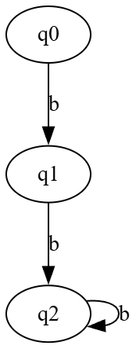
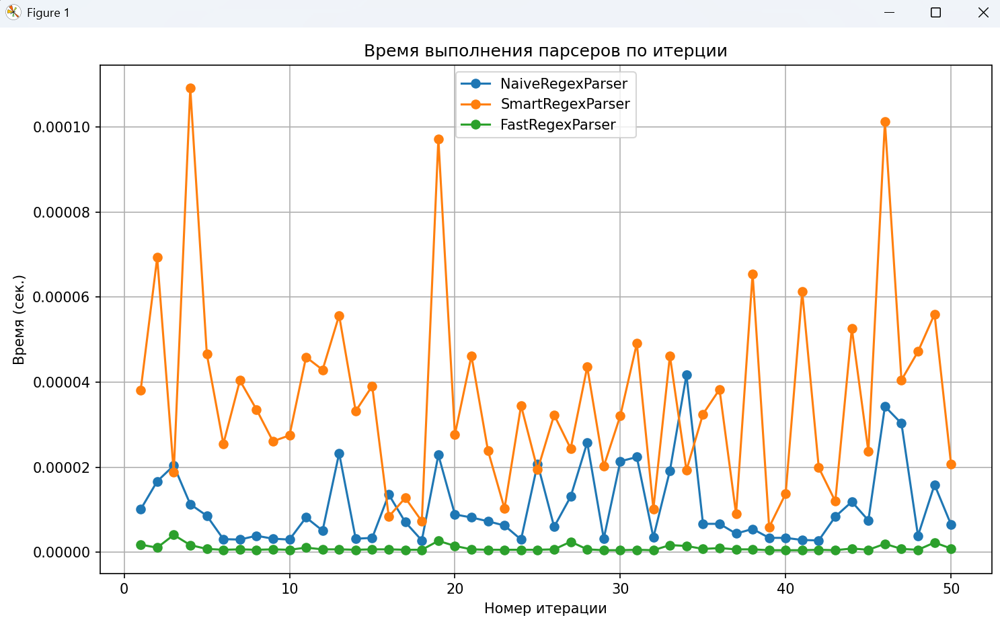
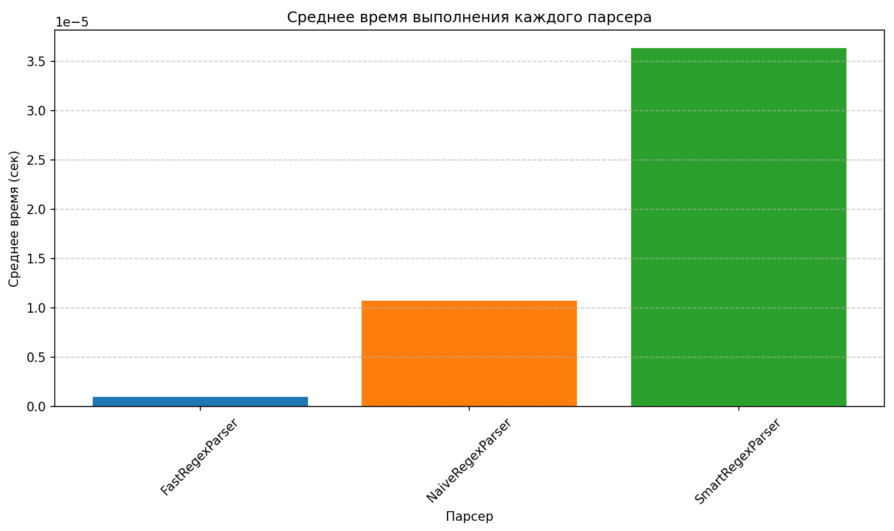
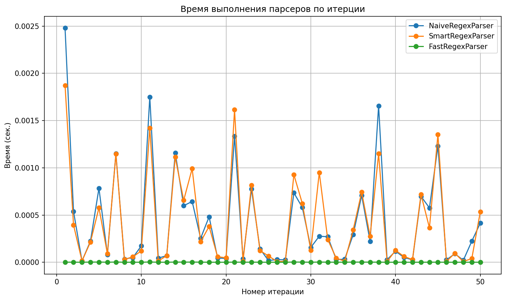
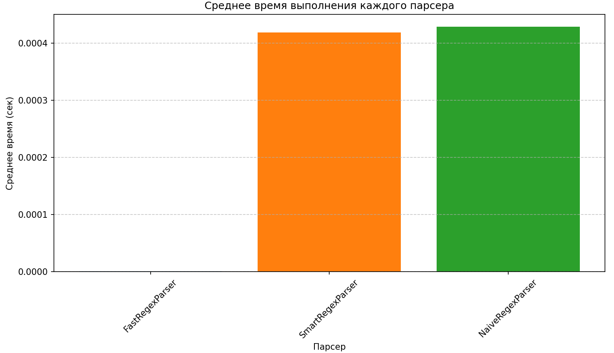
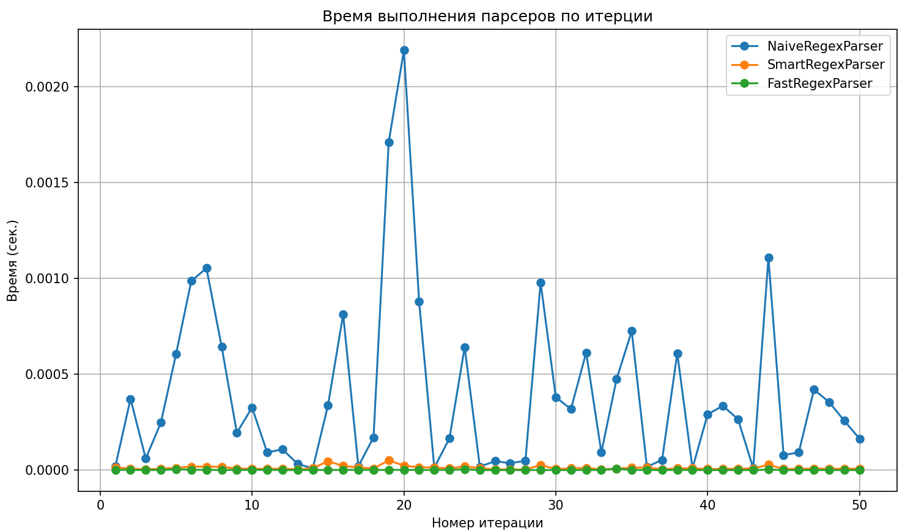
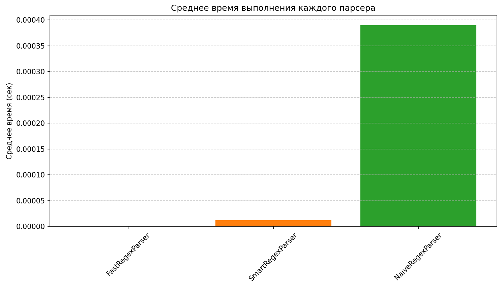
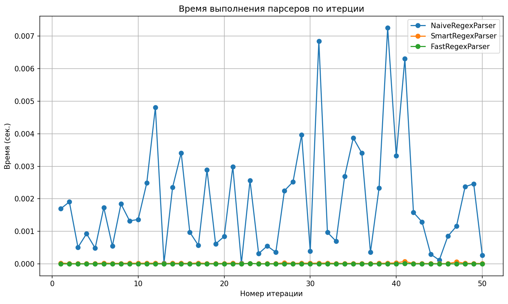
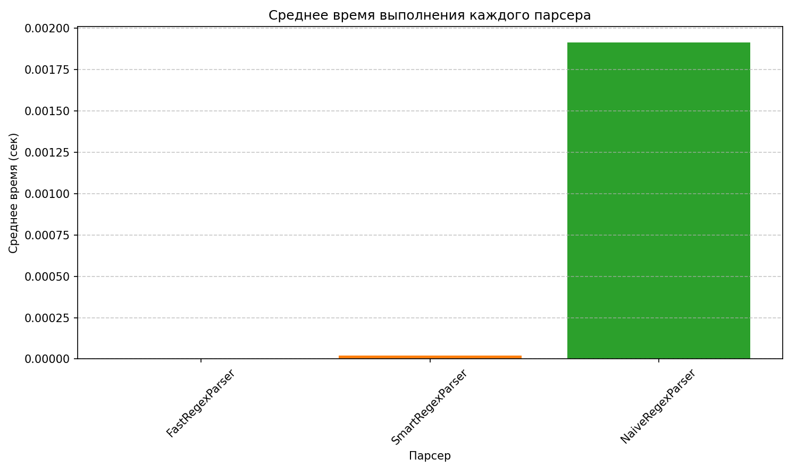

# Лабораторная работа №4 по курсу «Теория формальных языков»

Студент: Ладонцева Анна Андреевна ИУ9-52Б

Дано расширенное регулярное выражение (вариант 14): `^((a\2a+(?=a)|b)*)\1+$`


## Анализ регулярного выражения 
### 1. Общая структура

* ^ и $ — начало и конец строки.
* ((a\2a+(?=a)|b)*) — это Группа 1 (назовем её G1). Это наш «генератор шаблона».
* \1+ — это проверка на повтор. Она означает: «всё, что следует за Группой 1, должно быть точной копией (или несколькими копиями) того, что было захвачено в Группе 1».

### 2. Внутренность группы 1

Здесь есть вложенная Группа 2: `(a\2a+(?=a)|b)`.

Квантификатор `*` означает, что мы можем проходить через эту группу много раз, накапливая результат.
Ключевой элемент здесь — обратная ссылка `\2`.

Как работает этот цикл:

Итерация 1:
* Ссылка `\2` пока пуста (не инициализирована).
* Вариант `a\2a+...` не сработает (ссылка на пустую/несуществующую группу вызывает сбой сопоставления).
* Следовательно, срабатывает альтернатива `b`. 
* Результат: Текущий захват Группы 2 = `b`. Общая строка G1 = `b`.

Итерация 2:
* Теперь `\2` содержит `b`.
* Мы можем снова выбрать `b` или пойти по сложному пути: `a\2a+`.
* Подставим `b` вместо `\2`: получается `a` + `b` + `a+`. Это создает структуру вида `aba`, `abaa` и т.д. 
* Результат: Текущий захват Группы 2 становится, например, `aba`. Общая строка G1 = `b` + `aba`.

Итерация 3:
* Теперь `\2` содержит `aba` (результат предыдущего шага).
Если выберем сложный путь: `a` + `aba` + `a+`. 
* Результат: Получаем `aabaaa` (структура, где `b` в центре, обернутая слоями `a`).

### 3. Важный момент

В части `a\2a+(?=a)` есть опережающая проверка (lookahead).
Она требует, чтобы сразу после найденных символов `a+` шел еще один символ `a`.
Это создает жесткое ограничение на стыковку блоков:
* Если мы выбрали вариант с `a...`, мы обязаны продолжить так, чтобы следующим символом был `a`.
* Однако, следующий символ может быть либо началом новой итерации цикла, либо началом повтора Группы 1 (когда начнет работать `\1+`).

Логическая ловушка:
1. Группа 1 всегда начинается с `b` (так как первая итерация обязана быть `b`).
2. Следовательно, повтор `\1` тоже начинается с `b`.
3. Если мы находимся в ветке `a\2a+(?=a)`, то `(?=a)` требует, чтобы дальше шло `a`.
4. Если мы закончим формирование Группы 1 на этой ветке, следующим символом будет начало `\1`, то есть `b`.
5. Но `(?=a)` требует `a`. А у нас `b`. Конфликт!


Что это значит:
Такая конструкция приводит к тому, что выражение никогда не сработает для завершения группы на ветке с `a`.
Это означает, что после выбора ветки `a...` мы не можем выйти из цикла генерации, потому что выход означает встречу с `b` (началом копии `\1`), а нам нужно `a`.
Мы также не можем выбрать альтернативу `b` внутри цикла, потому что она тоже начинается с `b`.

## Вывод:
Из анализа можно сделать вывод, что строки, которые подходят под регулярное выражение, имеют вид `b^n`, где n>1 (так как должно быть повторение группы 1), что соответствует регулярному выражению `bb+`.


## Анализ на КС-свойство и наличие регулярности. 
Теперь мы можем анализировать не всё регулярное выражение, а его язык `L={b^n | n > 1}`

Этот язык является регулярным и КС, так как можно построить КС-грамматику и ДКА.

КС-грамматика:
S -> bA 
A -> bA | b



Лемма о накачке для регулярных языков: очевидно выполняется, можно накачивать кусок из `b`.
Проверка на пустоту, конечность: язык бесконечный.


## Парсеры

### Наивный парсер (NaiveRegexParser)
Использует рекурсивный разбор с возвратами для разбора строки.

**parse():** Главный метод, запускающий разбор.
Получает все возможные ответы из _parse_group_1_loop() и в цикле проверяет их с помощью _check_tail() 
пока не встретит подходящий вариант 
(пропускает вариант с пустой группой 1, потому что `\1+` требует непустой ответ).
Если подходящий найден, сразу возвращаем True, не проверяя оставшиеся результаты. 
Если подходящий не найден, возвращает False.


**_parse_group_1_loop(pos, current_g1, last_g2)**: Рекурсивно обрабатывает первую группу `((a\2a+(?=a)|b)*)`
* pos - позиция, с которой продолжить
* current_g1 - текущий захват группы G1 
* last_g2 - последний захват группы G2 
* Возвращает список пар (pos, current_g1)

Ключевой алгоритм **_parse_group_1_loop()** рекурсивно строит все возможные варианты для Group 1, возвращая 
список всех возможных пар (позиция, содержимое_g1)
1. добавляет входящие параметры (pos, current_g1) в список результатов 
2. проверяет альтернативу `b` для текущей позиции pos 
    - если найдена, то рекурсивно вызывает себя для позиции pos+1 и обновленных current_g1, last_g2.
    - добавляет результат рекурсивного вызова в массив ответов.
3. проверяет альтернативу `a\2a+(?=a)` для текущей позиции pos
    - проверяет символ `a` на позиции pos (`a`). 
    - проверяет last_g2 на позиции после `a` (`\2`).
    - считает кол-во `a` после last_g2 (`a+`). 
    - для всех найденных комбинаций из `a`, начиная с большей (механизм возврата):
         - проверяет, что следующий символ `a` (опережающая проверка `(?=a)`). 
         - если все проверки пройдены, то рекурсивно вызывает себя для позиции следующей за последним найденным `a` и обновленных current_g1, last_g2.
         - добавляет результат рекурсивного вызова в массив ответов.
4. возвращает массив ответов.

**_check_tail(pos, pattern)**
Проверяет, соответствует ли оставшаяся часть строки шаблону `\1+`. 
Начиная с позиции pos в исходной строке pattern должен встретиться непрерывно один и более раз.


Примеры работы:
Для строки "bbb" (принадлежит языку):
```
parse()
    _parse_group_1_loop(0, '', None)
        _parse_group_1_loop(1, 'b', 'b')
            _parse_group_1_loop(2, 'bb', 'b')
                _parse_group_1_loop(3, 'bbb', 'b')
                result = [(3, 'bbb')]
            result = [(2, 'bb'), (3, 'bbb')]
        result = [(1, 'b'), (2, 'bb'), (3, 'bbb')]
    result = [(0, ''), (1, 'b'), (2, 'bb'), (3, 'bbb')]
    пропускаем (0, '')  
    _check_tail(1, 'b') -> True
```

Для строки "abaabaaaaa", и любые строки начинающиеся с `a` (не принадлежат языку):
```
parse()
    _parse_group_1_loop(0, '', None)
    result = [(0, '')]
    пропускаем (0, '')  
    -> False
```

Для строки "babaaabaaaaababaaabaaaaa" (не принадлежат языку):
```
parse()
    _parse_group_1_loop(0, , None)
        _parse_group_1_loop(1, b, b)
            _parse_group_1_loop(5, babaa, abaa)
            result = [(5, 'babaa')]
            _parse_group_1_loop(4, baba, aba) # работа жадного +
                _parse_group_1_loop(11, babaaabaaaa, aabaaaa)
                result = [(11, 'babaaabaaaa')]
                _parse_group_1_loop(10, babaaabaaa, aabaaa)
                result = [(10, 'babaaabaaa')]
                _parse_group_1_loop(9, babaaabaa, aabaa)
                result = [(9, 'babaaabaa')]
            result = [(4, 'baba'), (11, 'babaaabaaaa'), (10, 'babaaabaaa'), (9, 'babaaabaa')]
        result = [(1, 'b'), (5, 'babaa'), (4, 'baba'), (11, 'babaaabaaaa'), (10, 'babaaabaaa'), (9, 'babaaabaa')]
    result = [(0, ''), (1, 'b'), (5, 'babaa'), (4, 'baba'), (11, 'babaaabaaaa'), (10, 'babaaabaaa'), (9, 'babaaabaa')]
    пропускаем (0, '')  
    _check_tail 1, b
    _check_tail 5, babaa
    _check_tail 4, baba
    _check_tail 11, babaaabaaaa
    _check_tail 10, babaaabaaa
    _check_tail 9, babaaabaa 
    -> False
```

### Оптимизированный парсер 1 (FastRegexParser)
Ключевой идеей этого парсера является проверка строки на наличие только символов `b` (так как анализ регулярного выражения показал, что ему соответствуют слова, состоящие только из `b`) и длиной не менее двух символов. 
На данный момент это самый быстрый способ парсить слова данного регулярного выражения.

**Алгоритмическая сложность:** O(N). Если строка состоит только из символов `b` (или ошибка находится в самом конце), алгоритм проходит по всей длине строки один раз.

### Оптимизированный парсер 2 (SmartRegexParser)
FastRegexParser является самым быстрым парсером, но для примера был написан еще один парсер SmartRegexParser.

SmartRegexParser - это более "умная" версия наивного парсера.

Ключевые отличия:

SmartRegexParser работает в три этапа, оптимизируя задачу за счет поиска периодичности строки:

1. Вместо попыток разобрать всю длинную строку целиком, парсер проверяет, что строка состоит из 
повторяющихся подстрок (проверяет `\1+`). Парсер перебирает возможные длины периода (length) от 1 до N/2. 
Если длина строки делится на length, он проверяет, состоит ли вся строка из повторений одной подстроки (unit).

Пример: abaabaaba (длина 9)
длина патерна = 1 , патерн = 'a' (9%1 = 0 -> проверяем)
длина патерна = 2 , патерн = 'ab' (9%2 = 1 -> не проверяем)
длина патерна = 3 , патерн = 'aba' (9%3 = 0 -> проверяем)
...
до середины слова (до середины +1, если строка нечетной длины)

2. Валидация единицы: Если структура повтора `(unit)\1+` подтверждена, парсер переходит к 
проверке, что unit соответствует шаблону `(a\2a+(?=a)|b)*`.

3. Поиск в глубину (DFS) с граничным предпросмотром: 
* Поддерживается состояние last_g2 (последняя захваченная группа `\2`).
* Обрабатываются ветки `b` и `a\2a+(?=a)`.
* Ключевая особенность: При проверке `(?=a)` в конце unit (на границе), алгоритм "заглядывает" 
в начало строки (так как unit повторяется, за его концом следует его же начало).

**Алгоритмическая сложность:** O(2^{L}), где L — длина короткого периода (максимальное L = N/2), что делает разбор практически мгновенным для правильных строк.
На практике, основываясь на возможных строках, из всех вариантов `a+` ("жадности") валидацию хвоста пройдет, как правило, только один — тот, который идеально "стыкует" следующий обязательный символ `b` с текстом. Это превращает процесс из дерева вариантов в почти прямую линию. То есть сложность близкая к O(N). 


Примеры:
строка = "abaabaaaaa"

```
No repetitions for unit a
No repetitions for unit ab
No repetitions for unit abaab
result = False
```

строка = "babaaabaaaaababaaabaaaaa"
```
No repetitions for unit b
No repetitions for unit ba
No repetitions for unit bab
No repetitions for unit baba
No repetitions for unit babaaa
No repetitions for unit babaaaba

Validating group: babaaabaaaaa

iteration 1. stack: [(0, None)]
processing 0 None, string: _babaaabaaaaa
branch b
push 1 b

iteration 2. stack: [(1, 'b')]
processing 1 b, string: b_abaaabaaaaa
branch a
a_count= 3
push 5 abaa
push 4 aba

iteration 3. stack: [(5, 'abaa'), (4, 'aba')]
processing 4 aba, string: baba_aabaaaaa
branch a
a_count= 4
text[0]= b
push 11 aabaaaa
push 10 aabaaa
push 9 aabaa

iteration 4. stack: [(5, 'abaa'), (11, 'aabaaaa'), (10, 'aabaaa'), (9, 'aabaa')]
processing 9 aabaa, string: babaaabaa_aaa
branch a

iteration 5. stack: [(5, 'abaa'), (11, 'aabaaaa'), (10, 'aabaaa')]
processing 10 aabaaa, string: babaaabaaa_aa
branch a

iteration 6. stack: [(5, 'abaa'), (11, 'aabaaaa')]
processing 11 aabaaaa, string: babaaabaaaa_a
branch a

iteration 7. stack: [(5, 'abaa')]
processing 5 abaa, string: babaa_abaaaaa
branch a
False
result = False
```

строка = "bbb"
```
Validating group: b
iteration 1. stack: [(0, None)]
processing 0 None, string: _b
branch b
push 1 b
iteration 2. stack: [(1, 'b')]
processing 1 b, string: b_
True
result = True
```


## Графики

#### 1. Рандомные (неверные) тесты



На многих случайных строках Наивный парсер быстро находит несоответствие с первых 2-3 символов.
Умный парсер пытается найти повторы, итерируясь по половине строки, поэтому часто проигрывает.


#### 2.1 Генерируется строка типа (b aba+ aaba+a+ ...)* 3



Так как группа 1 выглядит верной вплоть до последнего символа, оба парсера начинают разбирать строку, поэтому время приблизительно одинаковое, но Умный парсер еще тратит время на поиск повторов.

#### 2.2 Генерируется строка типа (b aba+ aaba+a+ ...)* 1



Наивный парсер начинает рекурсивно разбирать строку, а Умный, не найдя повторов, не проводит разбор, поэтому выигрывает.

#### 3. Рандомные (верные) тесты, где строка соответствует регулярному выражению bb+



Наивный парсер делает n-рекурсивных вызовов, где n - длина строки. Умный парсер находит повторяющуюся часть за одну итерацию и быстро ее проверяет за одну итерацию, поэтому выигрывает.

**Вывод:**
Быстрый парсер безусловный лидер, потому что работает по упрощенному регулярному выражению.
Умный парсер выигрывает у Наивного парсера на верных строках и на неверных строках похожих на группу 1 без повторов. Но проигрывает на случайных неверных строках. 