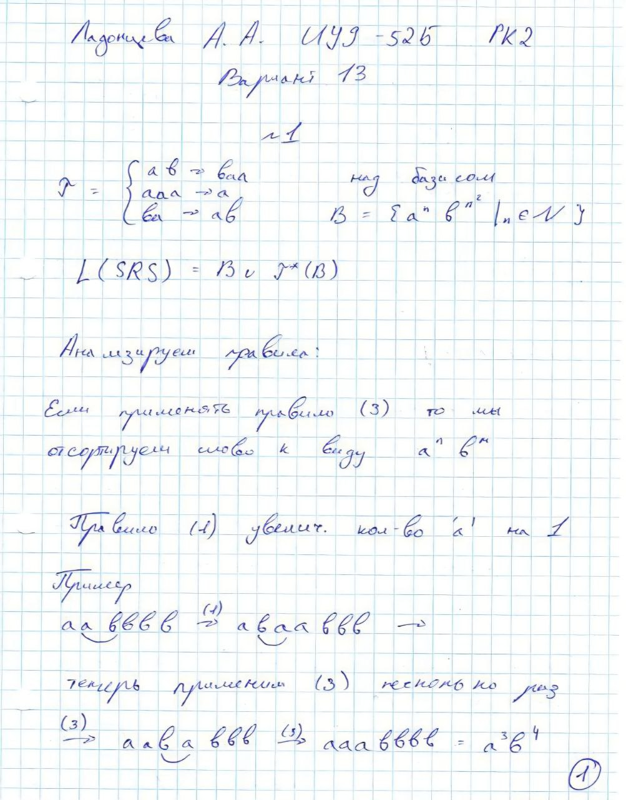
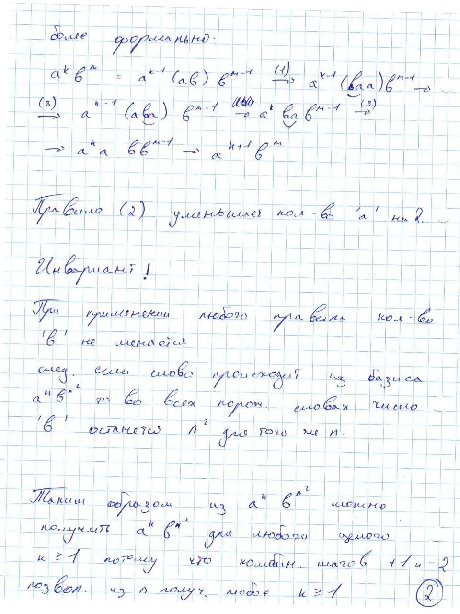
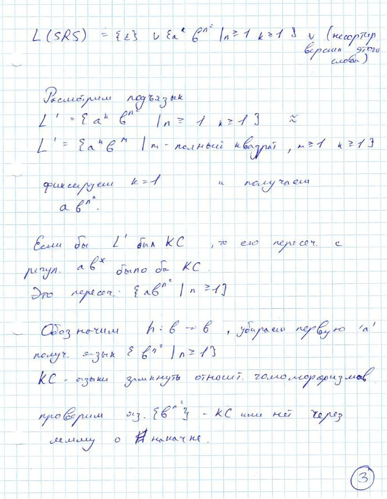
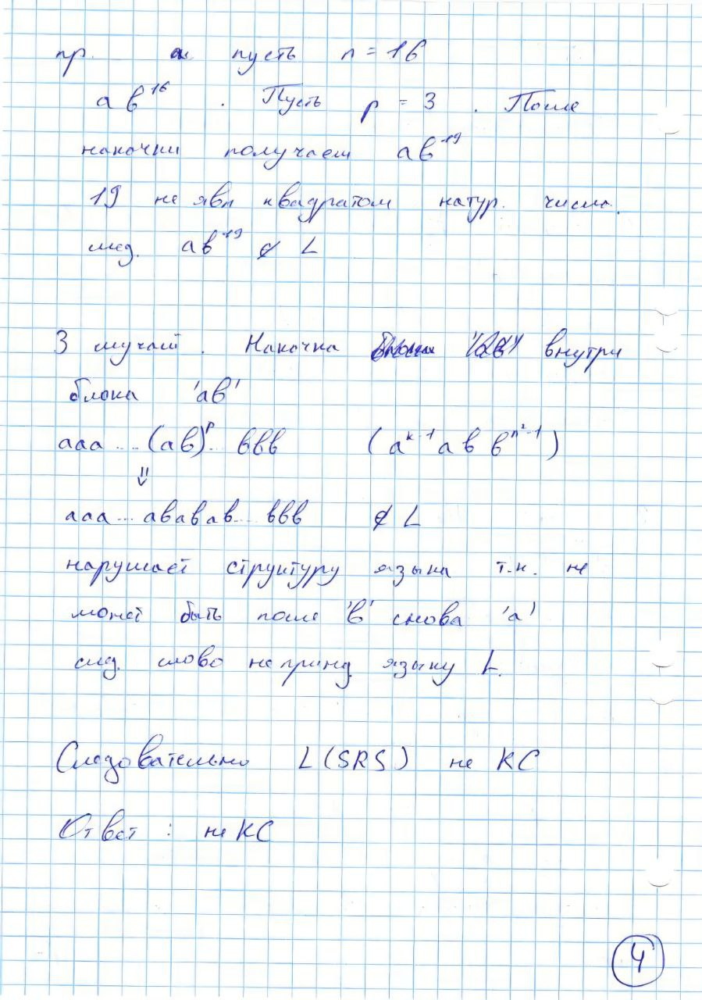
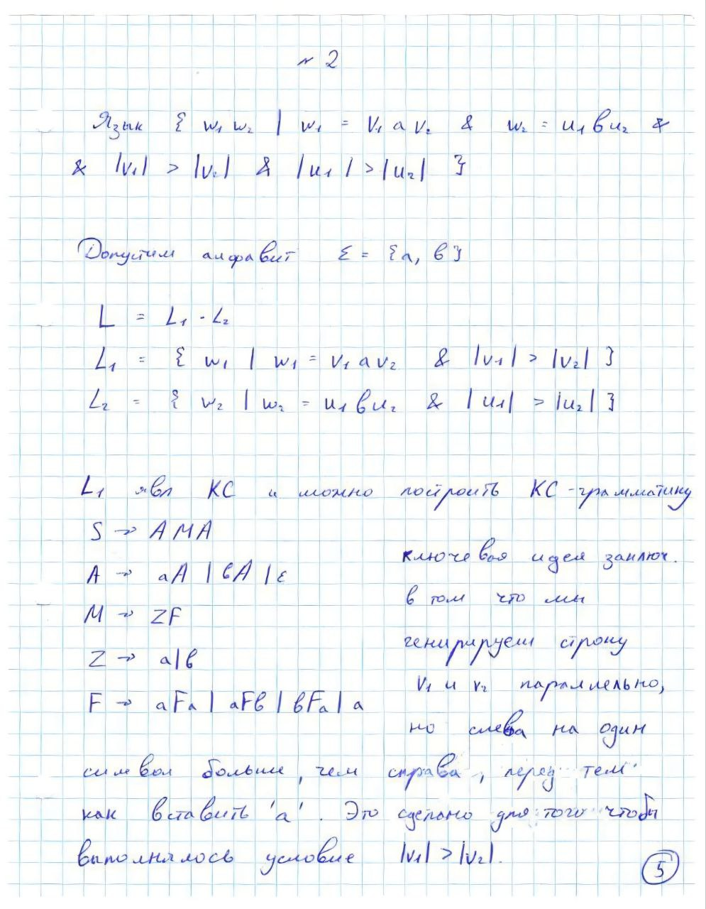
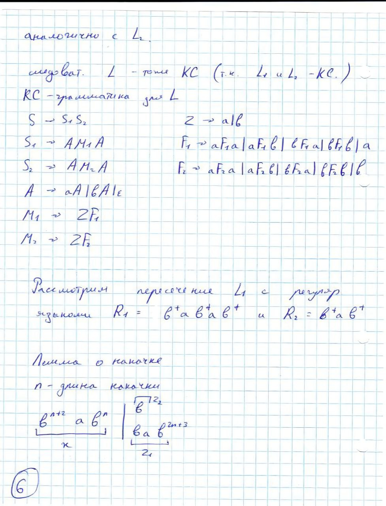
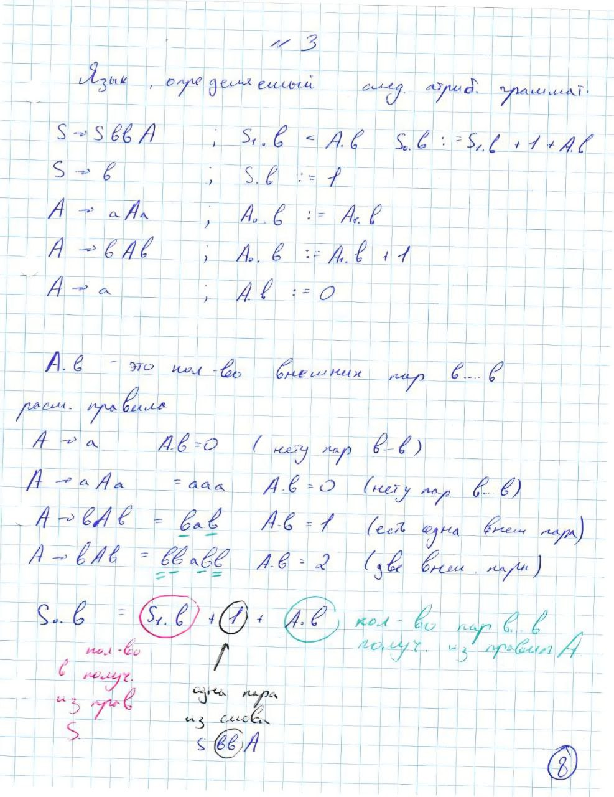
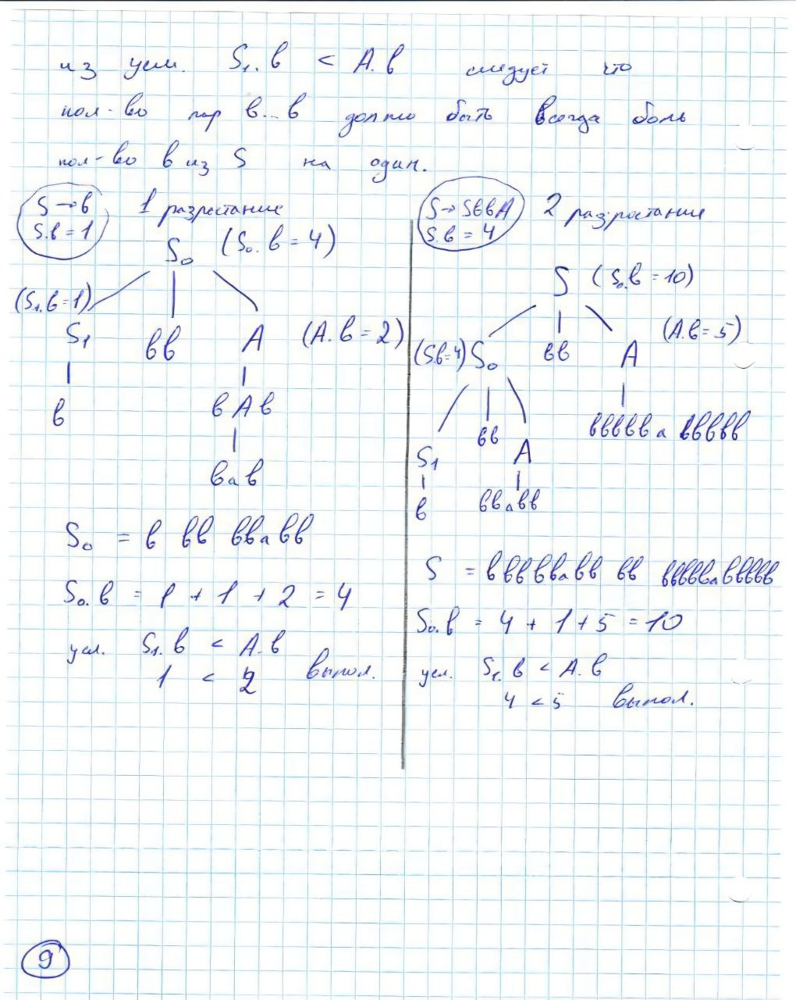
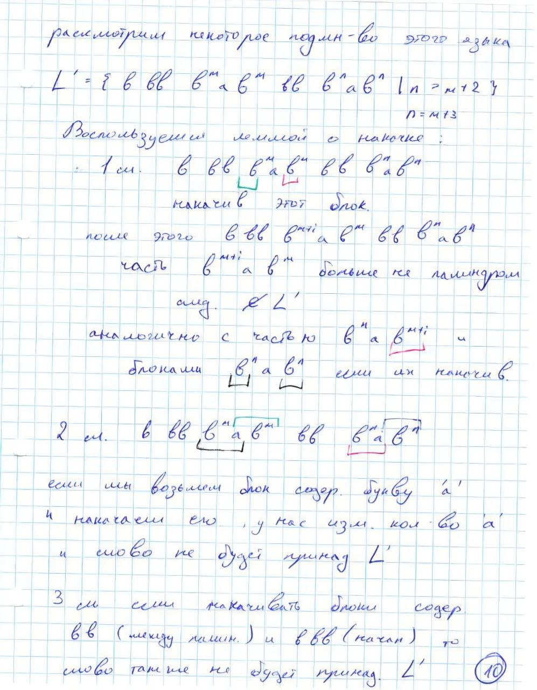
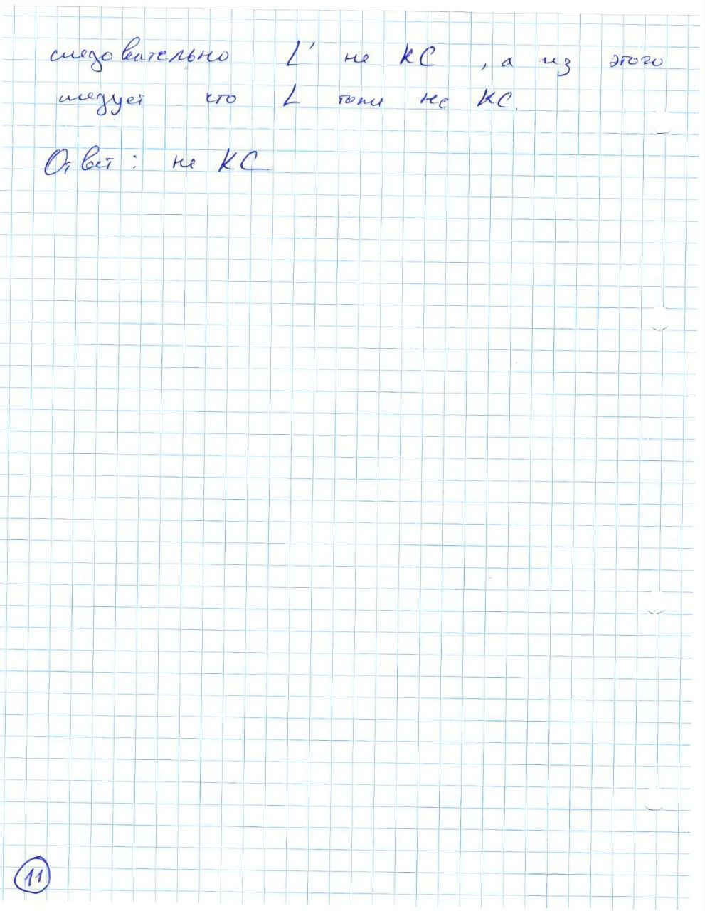

 # Рубежный контроль №2 по курсу «Теория формальных языков»

Студент: Ладонцева Анна Андреевна ИУ9-52Б

Вариант №13 

**1. Язык SRS с правилами ав → baa, aaa → a, ba → ab над базисом a^nb^n^2.**

Решение:

**2. Язык {w1w2 | w1=v1av2 & w2=u1bu2 & |v1| > |v2| & |u1| > |u2|}.**

Решение:

Один из вариантов старого решения
.jpg)
.jpg)

**3. Язык, определяемый следующей атрибутной грамматикой:**

S -> SbbA ; S1.b < A.b , S0.b := S1.b + 1 + A.b

S -> b    ; S.b := 1

A -> aAa  ;  A0.b := A1.b

A -> bAb  ;  A0.b := A1.b + 1

A -> a    ; A.b := 0

Решение:

